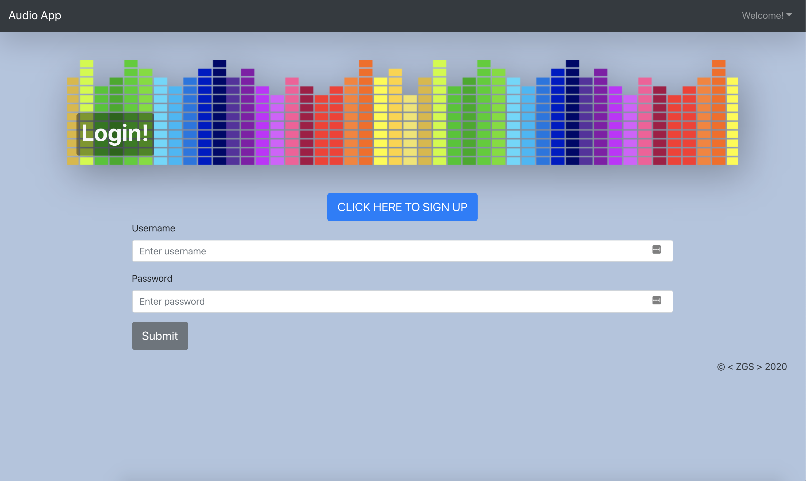
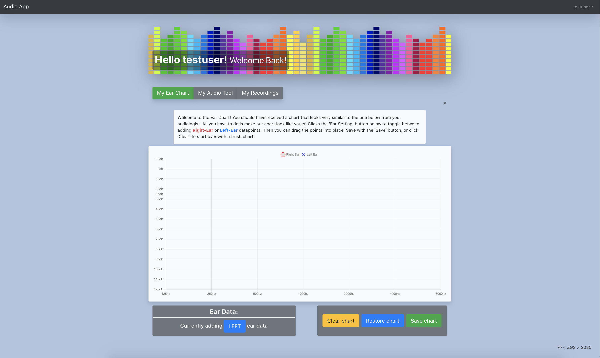
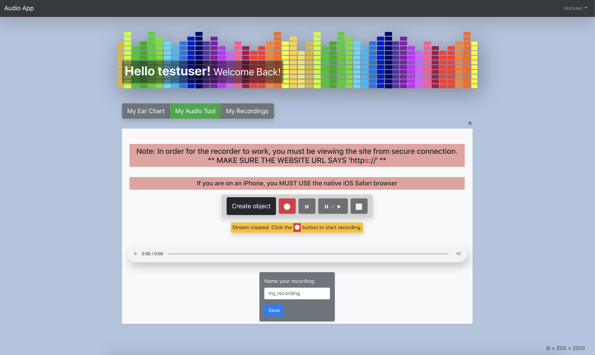
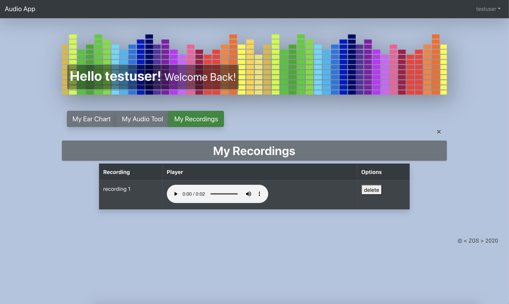

<a href="https://zgstowell-audiology.herokuapp.com/userpage/">
<h1>Unnamed Audio Test App</h1>
</a>

 

## Description: 
This 'work-in-progress' application is aimed at the parents of young children with impaired hearing. The user will enter data provided by their audiologist (such as the "Sensorineural Hearing Loss Audiogram"). This data is fed into a series of algorithms which create audio filters with the intention of recreating what is heard by the hearing-impaired child. Once the data is collected, the user can make recordings using their phone or laptop microphone, and the resulting recording will be played back with the generated filters. 

This will be a tool for audiologists to help parents understand their child's impairment and bring some clarity to the deluge of information provided to these parents. 

In addition, hearing-aid devices often over compensate at many frequency levels which can make certain sounds very uncomfortable to the child wearing them. By entering the 'aided' hearing test results, parents may be able to pinpoint sounds around them which may be upsetting their young child - who may be too young or otherwise unable to communicate this on their own!

## Table of Contents

* [Usage](#usage)
* [Technologies](#technologies)
* [Contributing](#contributing)
* [Questions](#questions)

## Usage: 
Navigate to the application - or click [HERE](https://zgstowell-audiology.herokuapp.com/userpage/)

### The Application
You will see the Login page:

Enter the following info to log into the test account: 
* **Username**: testuser
* **Password**: password123

*If you wish to create an account, click the button that says* CLICK HERE TO SIGN UP *and fill out the form. You will see the login form once your account is created.* 

### Entering Data
Once you log in you will see your user page and your hearing chart:

This is known as a Sensorineural Hearing Loss Audiogram. Many parents receive such a chart with the data on their child's specific hearing loss. This is the only data this app is able to interperet at this time.

When you have saved your data, you can close the chart by clicking the 'x' in the upper right corner, or toggling the green '**My Ear Chart**' button to the grey 'off' position. 

### Recording Audio
Click on the grey '**My Audio Tool**' button to open the audio recorder:

Click on '**Creat object**' to activate the recorder. 
* Click the red 'record' button to begin recording
* Click the 'pause' button to pause recording
* Click the 'pause/play' to resume recording from a pause
* Click the 'stop' button to end the recording.

When the recording is stopped, you are able to listen to your recording using the player directly below. **This recording will not be filtered in any way and represents the 'raw' form of the recording. You must SAVE the recording in order to apply the audio effects.** You will have the option to Save the recording, or to Download it to your computer.

### Listening to Saved Audio
Click on the gray **My Recordings** button to open the saved recording table:

Each row of this table displays the name of this recording, an audio player of the recording (with applied filters), and a delete button for removing it from your user profile. 

***Note:** Audio filters are not fully functional! If you are an audio engineer I would welcome your input on how to approach this type of manipulation (types of filters, Q factor, etc. etc. etc.)

## Technologies and APIs:
* [Web Audio API](https://developer.mozilla.org/en-US/docs/Web/API/Web_Audio_API)
* [ReactJS](http://www.reactjs.org)
* [Axios](https://www.npmjs.com/package/axios)
* [Bootstrap CSS](www.getbootstrap.com) / [React-Bootstrap](https://react-bootstrap.github.io/)
* [Cloudinary](http://www.cloudinary.com)
* [Chart.js](www.chartjs.org)
* [chartjs-plugin-dragdata](https://github.com/chrispahm/chartjs-plugin-dragdata)
* [OpusMediaRecorder](https://kbumsik.io/opus-media-recorder/)

## Contributing:

I am always open to suggestions and advice! If you are an audiologist or audio engineer I would be especially grateful for your input!

## Questions:
* GitHub Profile:  [the-medium-place](https://github.com/the-medium-place)
* Email: <zgstowell@gmail.com>

